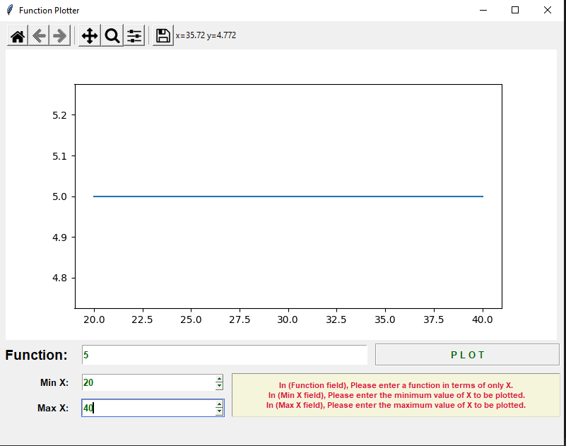
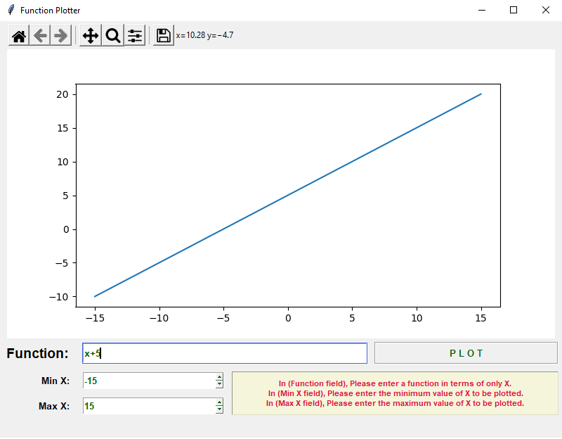
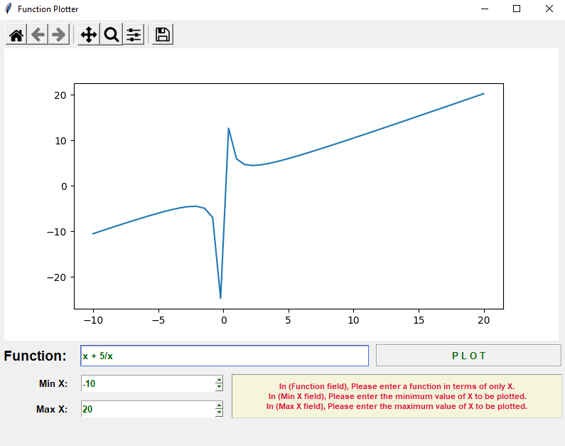

# FunctionPlotter
Simple and beautiful GUI program that plots arbitrary user-entered function.

## Description
- GUI program that plots arbitrary user-entered mathematical function.
- Taking a function of x, e.g., 5*x^3 + 2*x.
- Also Taking min and max values of x-axis from the user to fit the plot across it.
- The following operators is supported: + - / * ^.
- Appropriate input validation has been made.
- Displaying messages to the user to explain any wrong inputs.

## Used
- Python GUI Program
- [*Tkinter*](https://docs.python.org/3/library/tkinter.html)
- [*matplotlib*](https://matplotlib.org/stable/contents.html)
- [*PyInstaller*](https://www.pyinstaller.org/)

## Prerequisites
`For Code`
1. Python IDE (PyCharm is recommended)
2. Install numpy package
```
pip install numpy
```
3. Install matplotlib package
```
pip install matplotlib
```

`For Personal Use`
1. Get to the FunctionPlotter exe Directory
2. Douple Clicking FunctionPlotter.exe
3. cmd pops up, wait a little.
4. Now the app runs, enjoy !

## Working Shots




![5. Invalid [p1\] Input Function](RuntimeScreenshots/5. Invalid [p1] Input Function.png)
![6. Invalid [p2\] Input Function](RuntimeScreenshots/6. Invalid [p2] Input Function.png)
![7. Invalid [p3\] Input Function](RuntimeScreenshots/7. Invalid [p3] Input Function.png)
![8. Invalid [p2\] Min X](RuntimeScreenshots/8. Invalid [p2] Min X.png)
![9. Invalid [p3\] Max X](RuntimeScreenshots/9. Invalid [p3] Max X.png)


